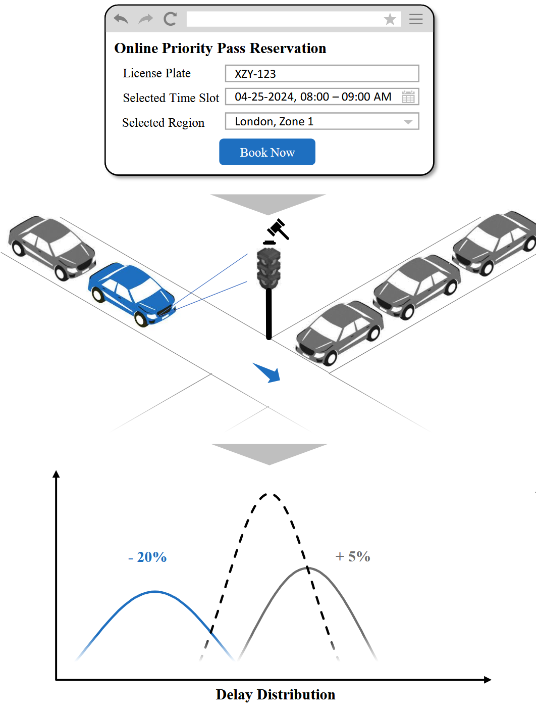
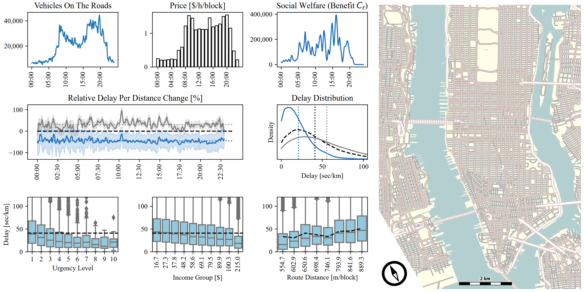

# Urban Priority Pass: Fair Signalized Intersection Management
## Accounting for Passenger Needs through Prioritization

**Authors:**        Kevin Riehl, Anastasios Kouvelas, Michail A. Makridis

**Organization:**   ETH Zürich, Switzerland

**Date:**           2025, August 12th

**Submitted to:**   Expert Systems With Applications (In Review)

----------

## Introduction

This is the online repository of *"Urban Priority Pass: Fair Signalized Intersection Management"*. 
This repository contains a Python-implementation of a traffic microsimulation to demonstrate the potential of **Priority Pass** controll concept. 
The repository is based on [SUMO (provided by DLR)](https://eclipse.dev/sumo/).

<table>
    <tr>
        <td></td>
        <td></td>
        <td></td>
    </tr>
    <tr>
        <td><center>No Control [200s]</center></td>
        <td><center>Fixed-Cycle Control [166s]</center></td>
        <td><center>Priority Pass Control [114s]</center></td>
    </tr>
</table>

## Abstract

<table>
    <tr>
        <td width="60%">
            Over the past few decades, efforts of road traffic management and practice have predominantly focused on maximizing system efficiency and mitigating congestion from a system perspective. 
            This efficiency-driven approach implies the equal treatment of all vehicles, which often overlooks individual user experiences, broader social impacts, and the fact that users are heterogeneous in their urgency and experience different costs when being delayed.
            Even though they are the major bottleneck for traffic in cities, no dedicated instrument that enables prioritization of individual drivers at intersections. <br> <br>
            The Priority Pass is a reservation-based, economic controller that expedites entitled vehicles at signalized intersections, without causing arbitrary delays for not-entitled vehicles and without affecting transportation efficiency de trop. <br> <br>
            Applicable especially to large, congested cities with rich sensor infrastructure, the prioritization of vulnerable road users, emergency vehicles, commercial taxi and delivery drivers, or urgent individuals can enhance road safety, and achieve social, environmental, and economic goals.
        </td>
        <td>
            
        </td>
    </tr>
</table>


A case study in Manhattan demonstrates the feasibility of individual prioritization (up to 40% delay decrease), and quantifies the potential of the Priority Pass to gain social welfare benefits for the people. 
A market for prioritization could generate up to 1 million $ in daily revenues for Manhattan, and equitably allocate delay reductions to those in need, rather than those with a high income.




## What you will find in this repository

This repository contains the simulation model and source code to reproduce the findings of our study.
The folder contains following information:

```
./
├── code/
|   ├── MFD_Analysis/
|   ├── DataAnalysis/
|   ├── MarketModel/
|   ├── NewYork_Analysis/
|   ├── TLS_Analysis/
│   └── TrafficModel_SUMO/
├── data/
│   └── ...
├── figures/
│   └── ...
└── models/
    ├── IntersectionA/
    │   └── ...
    └── Manhattan3x3/
        ├── Configuration.sumocfg  
        ├── Demand.xml
        ├── Network.net.xml
        └── ...
```

- The SUMO model and all related files can be found in folder folder `model/`. We played around with a single intersection `IntersectionA` as well we created the more complex, multi-intersection, Manhattan-like grid road network `Manhattan3x3`.
- The source code for this study can be found in folder `code/`, and consists of following parts (logical order).
  - `TrafficModel_SUMO` containts scripts with implementations of the traffic light controllers. Finding optimal parameters for these controllers can be found in `code/DataAnalysis/0_optim_benchmark_controller`.
  - `TrafficModel_SUMO` containts scripts with implementations of the traffic light controllers.
  - `MFD_Analysis` contains scripts that execute the microsimulations with different controllers and generate log files about traffic fundamentals and other efficiency measures.
  - `TLS_Analysis` contains scripts that execute the microsimulations with different controllers and generate log files about traffic lights for further analysis.
  - `MarketModel` contains an implementation of the model used to simulate the market of NewYork. Besides, it creates several figures for the paper.
  - `NewYork_Analysis` contains scripts to execute a combined microsimulation and market model simulation for the complete Manhattan / New York City case study. It generates log files about fairness, efficiency, and socio-economic data.
  - `DataAnalysis` contains scripts to generate final figures for the paper from the generated data.
- The log files (in zipped form) used for the parameter optimization of various controll algorithms can be foud in folder `data/`.
- Some of the figures used in the paper and this repository can be found in folder `figures/`.


## Installation \& Reproducibility Instructions

```
pip install -r requirements.txt
```

- Extensive amounts of microsimulations and market models have been executed, for ten different random seeds per parameter combination, to explore the performance of controllers for different parameters in a grid-search like fashion. Zipped versions of all log files can be found in the  
- After an optimal parameterization was identified, further simulations / analysis with deeper levels of logging and interest have been executed.
- Finally, these log files have been parsed and analysed, to draw conclusions and generate figures for the paper.


### Citation
```
@article{riehl2025,
  title={Urban Priority Pass: Fair Signalized Intersection Management – Accounting for Passenger Needs through Prioritization},
  author={Riehl, Kevin and Kouvelas, Anastasios and Makridis, Michail A.},
  journal/conference={Expert Systems With Applications (In Review)},
  year={2025}
} ```